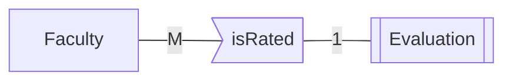

# Relationships

> #### Set of meaningful associations between participating [[Relational Databases#Entities | entities]]
>
> - Not to be confused with [[Relation]], means a table

> ###### Relationship occurrence: uniquely identifiable association
>
> - Staff **works_at** a DistributionCentre → **relationship**
> - Sally **works_at** Portland warehouse → **occurrence**

## Relationship Degree

> ##### No of participating entities involved in relationship
>
> - Unary (recursive), binary, ternary, ..., n-ary

## Cardinality of Binary Relationships

> ##### No of entity instances to which another instance can map under relationship

- 1-1
- 1-many
- many-many
  - Each entity in X can be associated with many entities in Y and each entity in Y can be associated with many entities in X

## Relationship Participation

- **Total participation:** every member of entity set must participate in relationship
- **Partial particpation:** not every entity instance must participate

### Min, max

> Min: least no of relationship instances an entity **must** participate in
>
> - can be 0 (partial)
> - or one or more

> Max: max no of relationship instances entity **can** participate in
>
> - can be 1 or many (N, M or *)

> ###### N.B 1…M $\equiv$ M…1

## Existence Dependency

> Entity Y is **existence dependent** on entity X if each instance of Y must have a corresponding instance of X
>
> - If this is the case Y must have **total participation** in its relationship to X

> If Y does not have its own candidate key, Y is a weak entity and X is a strong entity
>
> - Double rectangle for weak entity and double diamond for relationship with strong entity

## 1-1 Participation Constraints

### Total participation on both sides

- Combine into single table
- Of original PKs, one designated as PK, other is alternate

### Total participation on one side

- Possible to distinguish parent from child (Parent is entity with partial)
- Copy parent PK to child

### Optional participation on both sides

- Either entity can be parent
- Decide on parent and copy FK

## M-M

- Requires a seperate table, both PKs are copied as FKs to new table
- One or both PKs will form new tables PK, possibly in combination with another attribute
