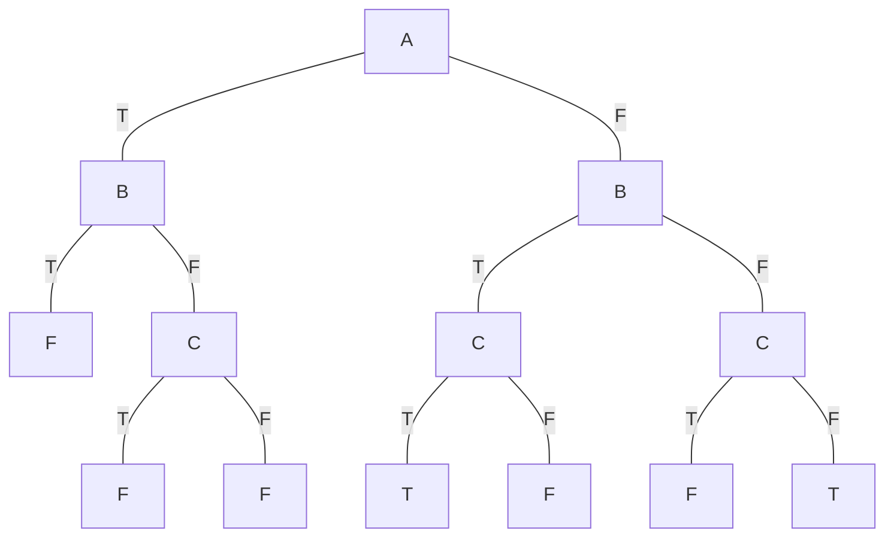

# Exam

_Y3891128_

## 1.

### 1.i

**(a)** [A B C D E F G H I J K]

**(b)** [A B E I F C D G J K H]

**(c)** [A B E F C D G H I J K]

**(d)** [A; A B C D; A B E F C D H; A B E I F C D G J K H]

### 1.ii

I would use a stack to represent the fringe. New nodes are added and removed at the top of the stack.

| Add/ remove nodes from top |
| :------------------------- |
| J                          |
| H                          |
| **Bottom of the stack**    |

## 2.

### 2.i

**State representation:** The start and end points of the bridge are represented as $B_0$ and $B_1$ respectively, where each point $B_p$ is a set of integers representing each person $P_i$ at that point. We also define a variable $T$ that tracks the movement of the torch between points. The overall state is a 2-tuple of sets and a variable:

> $\langle B_0, B_1 \rangle \ \ T$

**Initial state:** Every person starts at point $B_0$, and variable $T$ is initialized as 0

> $\langle B_0: \lbrace P_1, P_2, \ldots , P_n \rbrace ,\ B_1: \lbrace \rbrace \rangle \ \ T = 0$

**Goal test:** Every person is at point $B_1$, or equivalently point $B_0$ is empty

> $\forall i \in \lbrace \mathbb{Z}^+ < n \rbrace ,\ P_i \in B_1$ or $B_0 = \emptyset$

**Successor function:** Can be defined as a series of actions with appropriate preconditions and postconditions. Actions in this case consist of moving a set of people, $W$, between the two points with the function $MOVE(W, B_{in}, B_{out}, B, T)$. For example $MOVE(\{P_2, P_3\}, B_0, B_1, \langle B_0, B_1 \rangle, T)$ would people in $\{P_2, P_3\}$ from point $B_0$ to $B_1$. $B$ is the tuple set of all bridge points. $T$ is the position of the torch and is used to verify the other variables. The preconditions for the function are as follows:

We can also use the function $f_B: \langle \mathbb{N}^n, \mathbb{N}^n \rangle, \mathbb{N}^n, \mathbb{N}^n, \mathbb{N}\rightarrow \mathbb{B}$ to verify that the movement is correct based on the position of the torch

> $f_B(B, B_{in}, B_{out}, T) = \LARGE \left\{\ (B_0 = B_{out})\ \wedge\ (B_1 = B_{in}) \text{ if } T \text{ is even} \atop (B_1 =B_{out})\ \wedge\ (B_0 = B_{in}) \text{ if } T \text{ is odd} \right.$

We can then verify that the people that are moving are indeed from the point $B_{in}$

> $\large W \in \{ P_i,\ P_j\ |\ \exists\ i,j:\ P_i \in B_{in},\ P_j \in \{B_{in}\ \cup\ \lambda \},\ P_i \neq P_j \}$

Postconditions: These reflect an updated set of states after the $MOVE$ function has taken place

> $B_{out}' = B_{out} - W$
> $B_{in}' = B_{in} \cup W$
> $T' = T + 1$

**Path cost:** The summation of the time taken for each $MOVE$ to be made. A single move is equal to $\large 2^{max(i)}$ where $\large \exists i: P_i \in W$

### 2.ii

With an unoptimized approach all people crossing are equivalent, a depth-limited depth first search with a depth limit of $n - 1$ would be the best uninformed search for the problem. This has lower space complexity than a breadth-first search, and deals with issues from infinite repeated states that depth-first suffers from. We know that the depth of the goal state is $n - 1$ as in each cycle of people crossing and the torch getting back to the start point, one person is moved to the other side except the final iteration, where both people can move to the other side together without a person going back with the torch.

### 2.iii

An admissible heuristic could be the crossing time of the person with the smallest $i$ currently at point $B_0$ multiplied by the number of people at $B_0$

### 2.iv

In order to show that the heuristic $h(i, n)$ is admissible, we must show that the optimal path cost in the problem $f(i, n)$ is always greater than or equal to the heuristic. To do this, we could use proof by induction:

Prove that $h(i, n) \leq f(n)$:

The $i$ value is used to show the person $P_i$ with the shortest cross time, where $P_i \in B_0$. Therefore, for the proof of this question, we can assign this as a constant $j$

$n = 0:$
$\qquad$where $n = 0$, there are no persons at $B_0$ $\therefore$ $i = 0$
$\qquad h(0, 0) = 0$
$\qquad f(0, 0) = 0$
$\qquad$(If no person remains at $B_0$, we are in goal state so $f(0) = 0$,
$\qquad$if some people remain, they are not on $B_1$, so $f(0) > 0$)

For $n = k:$
$\qquad$$h(j, k) = 2^j \times k$
$\qquad$$f(j, k) \geq 2^j \times k$ (assumed true)

For $n = k + 1:$
$\qquad$$h(j, k+1) = 2^j \times (k + 1)$
$\qquad$$= 2^j \times k + 2^j$
$\qquad$$f(j, k + 1) \geq 2^j \times k + 2^j$

Adding one person must add another crossing, which will intuitively take at least as long as the person who crosses from $B_0$ the quickest.

For the special case $n = 2$, the two people can cross at the same time without having to return the torch, therefore the previous reasoning is invalid. However, as the two walkers must walk at the speed of the slowest walker, the speed of the slower walker must be at least _twice_ the time of the faster walker. ($2^{i+1} = 2 \times 2^i$ )

## 3.

### 3.i

$f'(x) = 4x^3$
$x_{n+1} = x_n - \eta f'(x_n)$

- $x_0 = 0.1$
- $x_1 = 0.0996$
- $x_2 = 0.0992$
- $x_3 = 0.0988$

### 3.ii

The function's minima is $x = 0$, at this point the gradient is 0, so there will be no difference between $x_n$ and $x_{n+1}$. Therefore, the algorithm will know it has reached the local minima and return the value (0) on the first loop.

### 3.iii

No, you could not use gradient descent to solve SAT problems as gradient descent requires the ability to differentiate a function, which is impossible in boolean logic.

## 4.

### 4.i

The minimax search algorithm will start at $s_1$ and attempt to maximize the outputs from its child nodes. It tries move A, and reaches $s_2$ where it will take the view of the opponent and try to minimize the output. Therefore, from $s_2$ it will pick move C as this is the smallest value. This is returned to $s_1$ and move A results in a value of 1.

The same is applied to move B, where $s_3$ will find the minimum value, which is the move B that returns 1. So $s_3$ will return 1 and move B results in a value of 1.

Move C reaches $s_4$, where the minima function will return the minimum value 8 from either move B or C. Therefore, $s_4$ returns 8 and the minimax algorithm chooses move C as it returns the highest value.

### 4.ii

Max should make move C as this forces the opponent to give an output of 8 or 16, which is better than the other two moves in which the opponent can give an output of 1

### 4.iii

Minimax can use heuristics to improve performance and cut down the number of branches that need to be evaluated, which can speed up the algorithm. Further, sometimes a game tree is just too large for the computer to completely solve and must rely on heuristics to evaluate the position.

## 5.

### 5.i

**(a)** $(\neg A \vee \neg B) \wedge (\neg B \vee C) \wedge (\neg C \vee B) \wedge (\neg A \vee C)$

**(b)** DPLL can be implemented as a DFS. $L$ is satisfiable by $\{A:F,\ B:T,\ C:T\}$ and $\{A:F,\ B:F,\ C:F\}$

**(c)** $(\neg B \vee C)$

### 5.ii

An inference algorithm is used to derive a sentence $\alpha$ from $KB$. You can do this by enumerating values in the $KB$ as a truth table to evaluate all possible settings of the symbols. This will check if $\alpha$ is “proven”. This is sound and complete, however is $2^n$.
