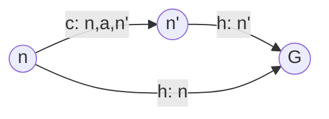

# Heuristic Search

## Trees

> ##### Only optimal with an **admissible** heuristic

- Uninformed search works based on structure of tree and cumulative path cost
- Informed search looks at states within the node to make a more informed choice

## Graphs

> ##### Only optimal with is **consistent** heuristic

### Consistency

> Most admissible heuristics are consistent

A heuristic $h(n)$ is consistent if:

For all $n$, every successor of $n'$ of $n$ by action $a$:

- $h(n) \leq c(n, a, n') + h(n')$
- No way of cheating the heuristic: No shorter path than going directly to the solution

## Picking a Heuristic

A heuristic $h_2(n)$ is said to **dominate** another heuristic $h_1(n)$ if:

> $\forall{n}, h_2(n) \geq h_1(n)$

- A* with $h_1$ will expand at least every node expanded by A* with $h_2$

### Bounded Relaxation

> Where we don't have an admissible heuristic, we can make a **relaxed** form of the problem where a heuristic is admissible

- By imposing a bound on this relaxation, we know how far from the optimal solution we would be

## Informed search

- Predict goal state can expand nodes more likely to reach goal sooner
- Evaluation function $f(n)$ is used to provide this signal allowing extra information to be used
- Common approach to defining $f(n)$ is to use a heuristic function $h(n)$
  - Typically fast to compute and provide domain specific information to search algorithm
  - e.g. Good heuristic in computing journey time is straight line distance to destination

## Heuristic Functions

> **Admissible:** Never overestimates the cost to reach the goal
>
> - e.g., straight line distance — it is **optimistic**
> - Proven through certain search functions will always find **optimal**

### Uniform-cost search (UCS)

Like breadth first but nodes stored in priority queue ordered by increasing path cost

### Greedy Best-First Search

> Expand node with lowest $f(n) = h(n)$

- Always uses lowest heuristic
- Maintain priority queue by increasing $f(n)$

#### Performance

- Completeness: No
- Time Complexity: $O(b^m)$
  - (Varies according to $h(n)$)
- Space Complexity $O(b^m)$
- Optimality: No
- (This is a worst-case, a good $h(n)$ can reduce this)

### [[A-star Search | A\* Search]]
