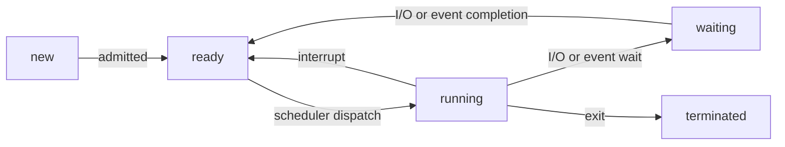

# Processes

> #### Program in execution
>
> ##### Program: static file on disk

### Process execution flow - need more here?

> ###### [[Scheduling#Dispatcher | Dispatcher]]: Innermost part of [[Operating System | OS]] that runs on each core. Switch threads through [[Context Switching]]

## Process life-cycle

## Parts

- Current activity: PC, registers
- Metadata: process ID, [[Scheduling]] info

| **High memory**                                     |
| --------------------------------------------------- |
| argc, argv                                          |
| [[Stack]]: temporary data, func param, local vars ↓ |
| [[Heap]]: memory dynamically allocated at runtime ↑ |
| uninitialized data: Uninitialized global vars       |
| initialized data: Global vars                       |
| text: code                                          |
| **Low memory**                                      |

## Process Control Block

- Process identifier: process ID, parent ID, group ID
- Process state: running, waiting
- PC, CPU registers,  CPU [[Scheduling]], memory allocation, I/O status
- Accounting information: CPU used, clock time elapsed, time limit

## Creating a process

> #### fork() ([[System Calls]])
>
> ###### Can also replace process by loading new program (fork → exec()) **cloning**

1. Allocates a slot in the process table for the new process
2. Assigns unique ID to child
3. Clones parent process and makes copy of process image includes data, code PCB (process control block previous lecture)
   - Does not clone shared memory (obviously no need to copy)
4. Child also owns any files owned by parent
5. Assigns child to ready state
6. Returns child ID to parent (0 to child to reflect parent)

- **Tree relationship of child processes**

## User & Kernel mode of child process

- fork() uses kernel mode of parent process
- Once finished, [[Kernel]] scheduler/ dispatcher can:
  - Stay in the parent process. Control returns to user mode at point of fork
  - Transfer control to another process
  - Parent process calls wait() - waiting for child to terminate
    - Orphan process: parent process has terminated but child still executing (not wait())
    - Orphan assigned to root process (systemd)
