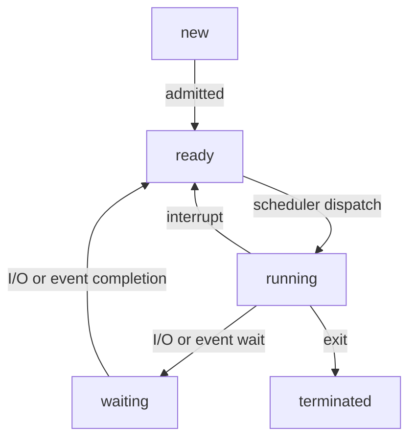

# Processes

> #### Program in execution
> ##### Program: static file on disk

### Process execution flow - need more here?
> ###### Dispatcher: Innermost part of [[Operating System | OS]] that runs on each core. Switches threads through [[Context Switching]]

## Process life-cycle

## Parts

- Current activity: PC, registers
- Metadata: process ID, [[Scheduling]] info

| **High memory**        |
| ------------------ |
| argc, argv         |
| [[Stack]]: temporary data, func param, local vars &darr; |
| [[Heap]]: memory dynamically allocated at runtime &uarr; |
| uninitialized data: Uninitialized global vars |
| initialized data: Global vars |
| text: code |
| **Low memory**        |

## Process Control Block
- Process identifier: process ID, parent ID, group ID
- Process state: running, waiting
- PC, CPU registers, [[CPU Scheduling]], memory allocation, I/O status
- Accounting information: CPU used, clock time elapsed, time limit

## Creating a process
> #### fork() ([[System Calls]])
> - Can also replace process by loading new program

