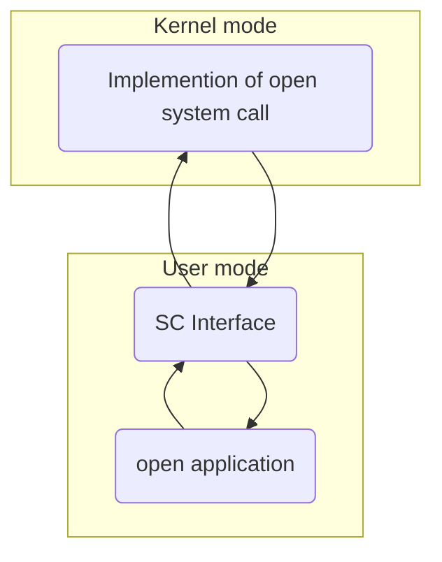

# System Calls

> ##### Programming interfaces to services provided by OS
>
> - Accessed by [[API]]s rather than direct sys call use
> - OS monitors sys calls

## User Space

> ###### Does not have direct access to hardware uses System Calls
>
> - CPU in user mode when executing user mode calls
> - Request of a kernel service

## Kernel Mode

> ###### Complete unrestricted access to hardware

