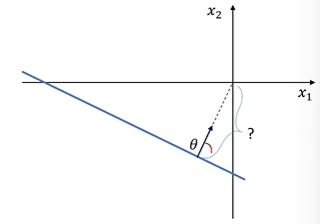

# Perceptron

> Find parameters that separate our data with a linear classifier

- Uses data and adjusts each piece of data

## Perceptron through origin

> (Then write in haskell) :laughing:

```pseudocode
func perceptron(D, T)
  (n, d) = D.shape # {(x_1, y_1), ..., (x_n, y_n)} where x_i is a vector of d elements
  D' = [[x_1], ..., [x_n]].T :: (d x n) # Each row is a vector of weights, with each example being a column
  labels = [y_1, ..., y_n] :: [1 x d]
  theta = zeros(d) :: (1 x d)
  theta_0 = 0 :: (1 x 1)

  for t in [1..T]
    for i in [1..n]
      x_i = D'[:, i].fst :: (d x 1) 
      y_i = data[:, i].snd :: (1 x d)
      if y_i * (theta.T @ x_i + theta_0) <= 0 then
        theta = theta += y_i * x_i
        theta_0 += y_i
      done
```

> Each **column** is a example, with each row being a weights of a single dimension

- $D$ is training set of $n$ data points, each with $d$ dimensions
  - $D = \{ (x_1, y_1), \ldots, (x_n, y_n) \}$
  - $x_j$ is a $d$-dimensional vector
    - $x_j = [x_1, \ldots, x_d ]$
- We show values of features as
  - $x_{j, i}$: is value of $i$-th _feature_ of $j$-th training _input vector_ 
  - $x_{j, 0} = 1$
- Weights
  - $\theta_i$ is the $i$-th value in the **weight vector**, to be multiplied with the $i$-th feature of the input feature
  - As $x_{j,0} = 1$, $\theta_0$ is the bias
- $T$ is the number of iterations

- If misclassify, $if$ will be less than 0
- $y$ (+1 or -1) determines what the correct will be based on whether y is positive or negative
  - $\theta = \theta + y^i x^i$ make theta more positive/negative (with the result) since it got the wrong answer
  - Same with $\theta_0$

## Linear separability

- For all data points, there exists a $\theta$ such that we can classify it without mistake

> If there is some $\theta$ such that $y^i (\theta^T x^i + \theta_0) \gt \forall i$

### Margin

#### Perpendicular distance from origin to hyperplane



> If the point is on the positive side of the hyperplane the distance should be positive and vice versa

Compute the distance

- Projection of vector $G$ onto vector $H$: $\frac{G \cdot H}{||H||}$
  - $G$ being random vector from the plane to the origin
  - $H$ being $\theta$ vector

> $\large \frac{(\begin{bmatrix}0 \\ 0 \end{bmatrix} - x) \cdot \theta}{||\theta||} = \frac{-x^T \theta}{||\theta||}$

As the hyperplane equation: $\theta^T x + \theta_0 = 0$
$\implies \theta_0 = -\theta^T x$ (Matrices are commutative)

> $\large \therefore \frac{\theta_0}{||\theta||}$

#### Perpendicular distance from any point to hyperplane

- Instead of $\begin{bmatrix}0 \\ 0 \end{bmatrix}$ we have vector $P$

$\large \frac{(P - x)^T \cdot \theta}{||\theta||} = \frac{P^T \theta - x^T \theta}{|| \theta ||}$

> $= \frac{P^T \theta - \theta_0}{||\theta||}$ - Distance from any point to hyperplane

#### Calculating margin

- Margin of a data point $(x, y)$  w.r.t. a separator $\theta_0$

> $\large y \cdot \frac{\theta^T x}{|| \theta ||}$

- Margin of $D$ w.r.t. $\theta$

> $\large \underset{i}{min}\ y^i\ \frac{\theta^T x^i}{||\theta||}$

- If dataset is linearly separable, then margin of the dataset will be positive
  - If not then will be negative as the minimum will be a negative point

#### Perceptron convergence theorem

- There is $\theta^*$ s.t. $\forall i\ y^i\ \frac{\theta^T x^i}{||\theta||} \geq \gamma \gt 0$
  - If dataset is linearly separable
  - Gamma is the min gap to the hyperplane
- $||x^i|| \leq R$
  - All data is bound in the space of a circle with radius $R$
  - $R$ is just an arbitrary number

Then the perceptron will make at most $\left( \frac{R}{\gamma} \right)^2$ mistakes in finding the linear separator.

