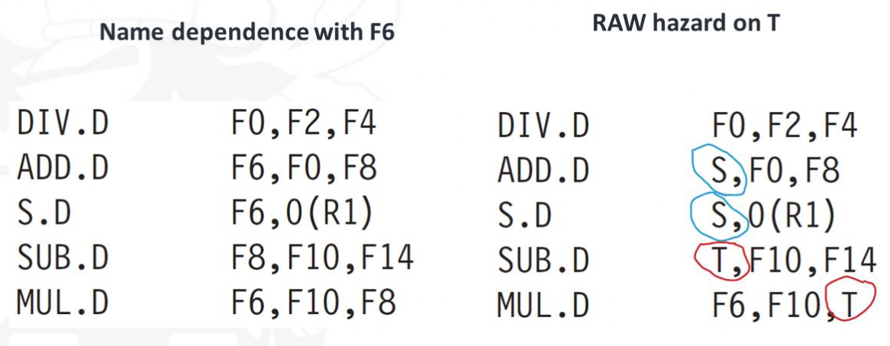

# Dynamic Scheduling

```
> Rearrange execution order of instructions
```

- Reduce stalls while maintaining data flow
- Compiler doesn't need to know microarchitecture
- Handles cases where dependencies are unknown at compile time

Disadvantages:

- Substantial increase in hardware complexity
- Complicates exceptions

[[Control Hazards#Branch Prediction]]


In a simple pipeline, if instruction $j$ depends on long-running instruction $i$, then all instructions after $j$ must be stalled until $i$ is finished and $j$ can execute.

## How dynamic scheduling works

- Separate the issue process into two parts
  - Checking for structural hazards
  - Waiting for the absence of a data hazard
- Use in-order instruction issue but want instruction to begin execution as soon as its data operands are available
- Out-of-Order execution $\rightarrow$ Out-of-Order completion
- Out-of-Order execution introduces WAR and WAW hazards

![[WAR-WAW-hazards.png|300]]

WAR & WAW hazards – solved by register renaming

Possibility of imprecise exception

- Pipeline may complete instructions that are later in program order than the instruction that causes the exception
- Pipeline may have not yet completed instructions earlier in the program order than the instruction causing the exception
- Usually have to rollback all instructions after the exception and ensure the instructions before the exception are complete

To allow out-of-order execution, split ID stage

- **Issue:** Decode instructions, check for structural hazards
- **Read operands:** Wait until no data hazards, then read operands

All instructions pass through the **issue stage in order**

- They can be stalled or bypass each other in the second stage

## Register renaming



### Reservation stations

> Used for register renaming

- Reservation stations contain:
  - The instruction (operation to be done)
  - Buffered operand values (when available)
  - Reservation station number providing the operand values
- Pending instructions designate the RS that provide input
- Result broadcast on common data bus (CDB)

Seven fields:

- **$Op$:** The operation to perform on source operands $S1$ and $S2$
- **$Q_{j}, Q_{k}$:** Reservation stations that will produce the corresponding source operand.
  - Value of 0 indicates source operand already available in $V_{j}$ or $V_{k}$
- $V_{j}, V_{k}$: Value of source operands.
  - For loads, $V_{k}$ field used to hold the offset field.
- $A$: Hold information for memory address calculation for load & store
  - Initially, immediate field of the instruction
  - After address calculation, the effective address stored here
- $Busy$: Indicates RS and its functional unit are occupied
