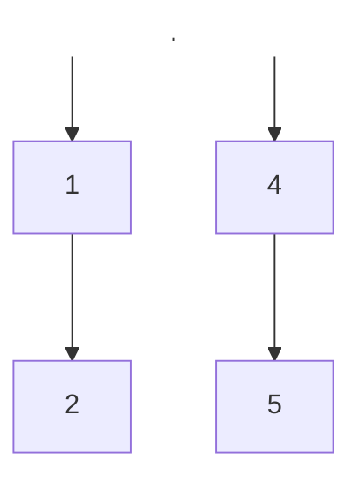
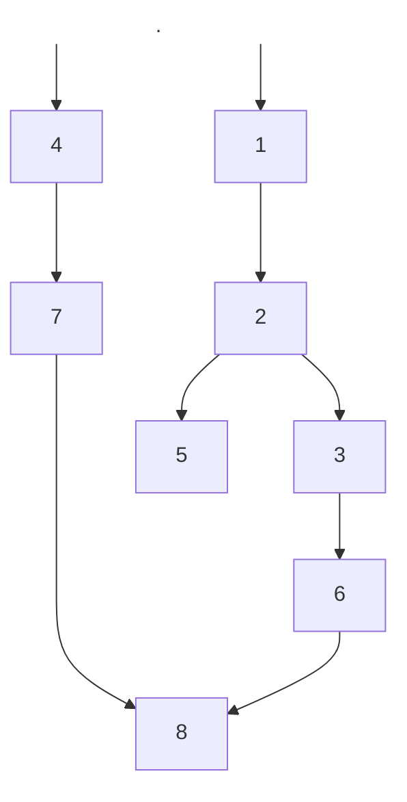

# Sys3 Open Assessment

_Y3891128_

## Part A

### A(i)

| Hazard Type | 1st Instruction | 2nd Instruction |
| ----------- | --------------- | --------------- |
| RAW         | (1, 6, WB.3)      | (2, 5, RR.3)    |
| WAW         | (2, 8, WB.5)    | (3, 7, WB.5)    |
| WAW         | (4, 9, WB.2)    | (5, 8, WB.2)    |
| Structural  | (2, 8, WB.5)    | (5, 8, WB.2)    |
| Memory      | (2, 4, OF)      | (4, 4, IF)      |

### A(ii)

| Hazard Type | 1st Instruction | 2nd Instruction | 3rd Instruction |
| ----------- | --------------- | --------------- | --------------- |
| Memory      | (1, 3, OF)      | (3, 3, IF)      |                 |
| Memory      | (2, 4, OF)      | (4, 4, IF)      |                 |
| Structural  | (1, 7, IALU)    | (3, 7, IALU)    | (4, 7, IALU)    |
| Structural  | (3, 8, WB.5)    | (4, 8, WB.2)    |                 |
| WAR         | (1, 5, RR.3)    | (3, 5, WB.3)    |                 |

### A(iii)

| Hazard Type | 1st Instruction | 2nd Instruction | 3rd Instruction |
| ----------- | --------------- | --------------- | --------------- |
| Structural  | (2, 4, RR.3)    | (3, 4, RR.5)    | (4, 4, RR.7)    |
| Structural  | (1, 6, IALU)    | (2, 6, IALU)    | (4, 6, IALU)    |
| Structural  | (3, 6, FALU)    | (6, 6, FALU)    |                 |
| Structural  | (2, 8, WB.4)    | (6, 8, WB.12)   |                 |
| Memory      | (1, 7, DS)      | (2, 7, DF)      | (5, 7, OF)                |

## Part B

### B(i)

| Instr. |     |     |     |      |      |      |      |      |      |      |      |                    |
| ------ | --- | --- | --- | ---- | ---- | ---- | ---- | ---- | ---- | ---- | ---- | ------------------ |
| 1      | IF  | ID  | OF  | RR.2 | RR.3 | IALU | IALU | DS   |      |      |      |                    |
| 2      |     | IF  | ID  | OF   | ---  | WB.3 |      |      |      |      |      |                    |
| 3      |     |     | --- | ---  | IF   | ID   | RR.4 | IALU | IALU | WB.5 |      |                    |
| 4      |     |     |     | ---  | ---  | IF   | ID   | RR.2 | IALU | ---  | WB.2 |                    |
|        | 1   | 2   | 3   | 4    | 5    | 6    | 7    | 8    | 9    | 10   | 11   | $\leftarrow$ cycle |

### B(ii)

| Instr. |     |     |     |      |      |      |      |      |      |      |                    |
| ------ | --- | --- | --- | ---- | ---- | ---- | ---- | ---- | ---- | ---- | ------------------ |
| 1      | IF  | ID  | OF  | RR.2 | RR.3 | IALU | IALU | DS   |      |      |                    |
| 2      |     | NOP |     |      |      |      |      |      |      |      |                    |
| 3      |     |     | IF  | ID   | OF   | WB.3 |      |      |      |      |                    |
| 4      |     |     |     | IF   | ID   | RR.4 | IALU | IALU | WB.5 |      |                    |
| 5      |     |     |     |      | NOP  |      |      |      |      |      |                    |
| 6      |     |     |     |      |      | IF   | ID   | RR.2 | IALU | WB.2 |                    |
|        | 1   | 2   | 3   | 4    | 5    | 6    | 7    | 8    | 9    | 10   | $\leftarrow$ cycle |

### B(iii)

| Instr. |     |     |      |      |       |       |      |       |       |      |      |                    |
| ------ | --- | --- | ---- | ---- | ----- | ----- | ---- | ----- | ----- | ---- | ---- | ------------------ |
| 1      | IF  | ID  | RR.1 | RR.2 | IALU  | WB.3  |      |       |       |      |      |                    |
| 2      |     | IF  | ID   | OF   | WB.13 | IALU  | IALU | IALU  | WB.5  |      |      |                    |
| 3      |     |     | IF   | ID   | RR.4  | IALU  | IALU | WB.15 |       |      |      |                    |
| 4      |     |     |      | IF   | ID    | RR.13 | IALU | WB.2  |       |      |      |                    |
| 5      |     |     |      |      | IF    | ID    | OF   | RR.9  | RR.15 | IALU | WB.2 |                    |
| 6      |     |     |      |      |       | IF    | ID   | WB.19 |       |      |      |                    |
|        | 1   | 2   | 3    | 4    | 5     | 6     | 7    | 8     | 9     | 10   | 11   | $\leftarrow$ cycle           |

- I am making the assumption that we can still have memory hazards
- Current memory hazard: (2,4,0F) (4,4,IF)

## Part C

### C(i)

| Test Case | Serial cycles | Pipelined cycles (hazards) | Pipelined cycles (hazards resolved) | Speedup (hazards) | Speedup (hazards resolved) |
| --------- | ------------- | -------------------------- | ----------------------------------- | ----------------- | -------------------------- |
| B(i)      | 23            | 8                          | 11                                  | 2.9               | 2.1                        |
| B(ii)     | 23            | 8                          | 10                                  | 2.9               | 2.3                        |
| B(iii)    | 35            | 11                         | 11                                  | 3.2               | 3.2                        |

### C(ii)

**(a) RAW:** An instruction $I_1$ intends to write to a register $R$. However, before the W.B cycle is executed, a later pipelined instruction, $I_2$ reads $R$. This causes $I_2$ to have an outdated version of $R$, not the value that would be written from $I_1$.

Solution: Insert stalls before the R.R cycle in $I_2$ until it is executed the cycle after the W.B in instruction $I_1$.

**(b) WAR:** An instruction $I_1$ intends to read a register $R$. However, before the R.R cycle is executed, a later pipelined instruction $I_2$ writes a new value to $R$. This causes $I_1$ to read the new incorrect value of $R$, rather than the expected result that $I_1$ would read the value in $R$ present before either instruction was executed.

Solution: Insert non-dependant instructions between the read and write instructions, such that the W.B cycle occurs at least a cycle after the R.B cycle. If no non-dependant instructions exist in this particular context, insert NOP instructions.

**(c) WAW:** Instructions $I_{1}, I_{2}$ intend to write to register $R$, such that instruction $I_1$ is executed before $I_2$. A WAW hazard occurs when $I_2$ executes its W.B cycle before $I_1$, causing the value from $I_2$ to be overwritten by the value from $I_1$, once $I_1$ executes its W.B cycle.

Solution: Operand forwarding with Tomasulo algorithm, which uses register renaming.

Rename the second write instruction register with a new register, and rename any occurrences of that register in instructions after the second write to the new register.

## Part D

### D(i)

A DAG represents the dependencies within a “basic block”, a sequential code sequence with no branches except entry and exit. Each instruction is represented as a node, and the edges between them as dependencies. A dependency arises when an instruction must be executed before another instruction for the execution and result of the program to be the same. If instruction $I_2$ must be executed after $I_1$, then we say that $I_2$ is _dependent_ on $I_1$.

The DAG referenced in the paper has three types of dependencies: _definition vs. definition_ (two instructions writing to the same register, a potential WAW hazard), _definition vs. uses_ (a value stored to a register, and loaded in a subsequent instruction, a potential RAW hazard) and _uses vs. definition_ (a register used in an instruction, then being overwritten in a subsequent instruction, a potential WAR hazard).

Any edge $\vec{ab}$ asserts that the two instructions $a$ and $b$ have a dependency and that the compiler must execute $a$ before $b$. Using the DAG, the compiler can rearrange the execution order, while ensuring dependant instructions are executed sequentially. This can allow the compiler to use dynamic scheduling, while avoiding any register hazards that might occur.

### D(ii)

CODE:
```asm
// Potential WAW (1, 2)
1. IMUL R1, R1, R2
2. IADD R3, R3, R2 

// Potential WAR (3, 4)
3. LDR R9, R5
4. IADD R9, R9, R6
```

Instructions 1 & 2 give an example of a potential WAW hazard, where instruction 1 attempts to store a value to $R2$, followed by instruction 2 attempting to store a value in $R2$. This is referenced in the DAG as a _definition vs definition_ dependency. If instruction 1 were to take place after instruction 2, $R2$ would contain the result of instruction 1, not the desired result of instruction 2.

Instructions 3 & 4 give an example of a potential WAR hazard, where instruction 3 attempts to store a value in $R9$ followed by instruction 4 which attempt to use $R9$ as a source. This is referenced in the DAG as a _definition vs use_ dependency. If Instruction 4 were to take place before instruction 3, instruction 4 would use the value previously in $R9$, not the new value loaded in instruction 3.



### D(iii)

TEST CASE:
```asm
1. LDR R1, R5
2. LDR R5, R6
3. IMUL R3, R6, R8
4. IMUL R1, R4, R4
5. IADD R2, R6, R5
6. IMUL R3, R6, R8
7. IMUL R1, R4, R4
8. IADD R4, R8, R7
```


